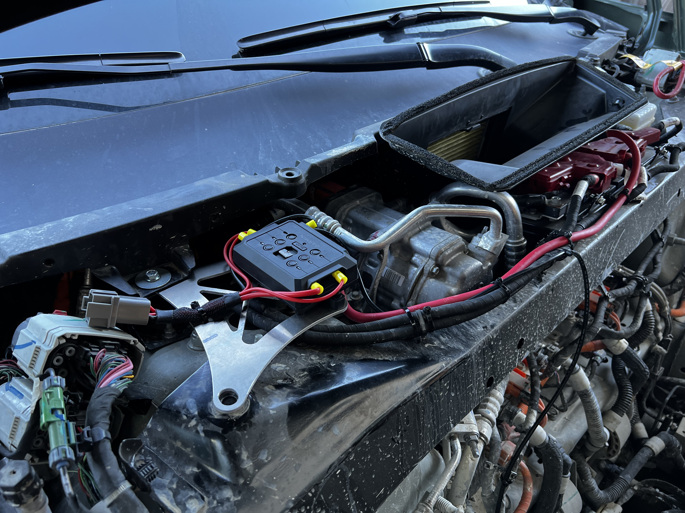

# Garmin Powerswitch Mount

The [Garmin Powerswitch](https://www.garmin.com/en-US/p/718849) is a great tool for controlling aftermarket things that need 12v. This mount provides an easy mounting setup
for a Rivian vehicle.

WARNING: At the time of writing, this design has only been verified on a gen1 Rivian vehicle.

If someone tries this on a gen2, can they please contact the repo owner with the results? Thank you!

## Components

Part | Qty | Vendor | Material | Notes
-|-|-|-|-
Garmin Powerswitch | 1 | Garmin | N/A | Circuit controller, comes with most wiring you'll need to install it
Controller Bracket | 1 | SendCutSend or OshCut | 0.125" thick 5052 Aluminum | Paint it or anodize it

## Component Notes

### Garmin Powerswitch

The switch comes with wiring sufficient to connect the PowerSwitch to the Rivian, but nothing for the PowerSwitch -> Lights or w/e you're running.

You'll probably need to provide your own mounting bolts from the PowerSwitch to the bracket. M4x15mm + nylock nuts works nicely.

### Bracket

Send the DXF to either SendCutSend, or OshCut. Have it cut from 0.125" thick 5052 Aluminum. I suggest powder coat, anodizing, or painting the bracket prior to installation.

Either vendor above should come out with a delivered cost of less than $50 USD.
