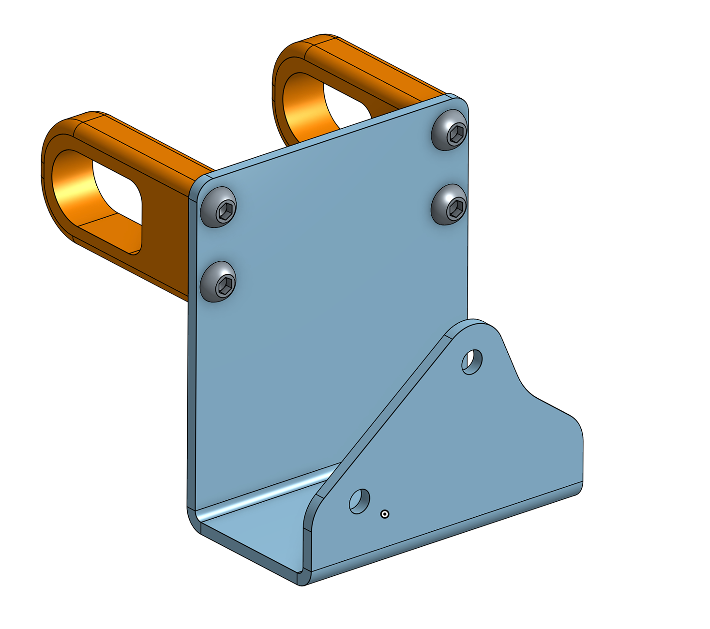

# Apex Designs Air Reel Mount

The [Apex Designs Compact Reel System (CRS)](https://www.apexdesignsusa.com/products/compact-reel-system-crs) is a great way to speed up airing tires up and down while using the R1T's built in air compressor.
These files allow mounting the CRS to the R1T's gearguard lock socket in the bed. The advantages are many:

* You can remove it easily to gain access to the spare tire compartment
* If you need 100% of the bed for gravel or something, it's quick to remove
* Very secure mounting without needing to lock the truck
* Directly below the air compressor controls, allowing for easy control access
* Modular: You can pop it out and lend it to your friends

...and so on.

## Components

Part | Qty | Vendor | Material | Notes
-|-|-|-|-
Air Reel Bracket | 1 | SendCutSend | 0.125" thick Aluminum 5052 | Black Anodized works and looks great
Gear Guard Insert | 2 | multiple, see below | Nylon, Aluminum, etc | See below for notes
M6x10 BHCS | 4 | McMaster | 18-8 Stainless Steel | Buy a bag of [these](https://www.mcmaster.com/90991A122/)

## Component notes

### Air Reel Bracket

For the bracket, either SendCutSend or OshCut are great vendors to get this part made. It's designed with the appropriate k-factor for 0.125" 5052 Aluminum, so try to stick to that material.
Finishing choices are up to you, it can be powdercoated, anodized, or left bare.
Both the STEP solid file and DXF for the layout are included here in this repo.

### Gear Guard Insert

I reccomend having this made from 6061-T6 Aluminum, and anodized some color of your choice. If going with aluminum, the STEP file paired with the drawing will be sufficient for
any competent machine shop to produce these parts. The tapped holes are M6x0.7 threaded.

However, we've had success with a set of 3D printed inserts. I printed them solid from nylon, and tapped the holes for M6x0.7 thread fasteners. If they break, I plan to order
some machined aluminum ones, but that hasn't happened yet.

If you're going with machined inserts, I suggest hubs.com, or JLC3Dp.com for small-batch machined parts that won't cost an arm and a leg.

### Fasteners

The author prefers 18-8 stainless BHCS for this use, purely for the style: Shiny silver fasteners on black anodized aluminum looks great.

## Closing notes

Thanks for checking out the openOffRoad project! If you modify these designs, please contribute!
